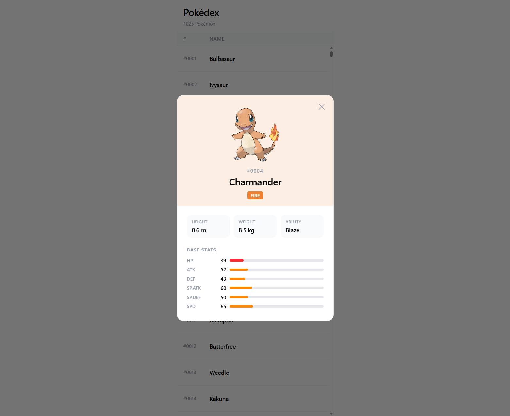

# Pokédex Virtualized



A small side project built to explore virtualized lists in React. A standard technique for whenever I need to render large datasets without sacrificing performance.

## Why I built this

Keeping experiences fast is a constant concern in frontend engineering. Rendering hundreds or thousands of DOM nodes at once tanks scroll performance and wastes memory. Virtualization solves this by only rendering the rows currently visible in the viewport, regardless of how large the full list is.

I wanted a hands-on project to put this into practice, so I built a Pokédex with all 1,025 Pokémon using TanStack Virtual for the virtualized list and TanStack Query for data fetching and caching.

## Features

- Virtualized list rendering ~15 rows at a time regardless of total count.
- Full list of 1,025 Pokémon fetched in a single request and cached permanently.
- Click any row to open a detail modal with official artwork, types, base stats, and quick facts.
- Detail fetches are cached per Pokémon and clicking the same one twice hits the cache reducing the need for extra API calls.

## Tech stack

- [React](https://react.dev/) + [TypeScript](https://www.typescriptlang.org/)
- [Vite](https://vitejs.dev/)
- [TanStack Query](https://tanstack.com/query) — server state management and caching
- [TanStack Virtual](https://tanstack.com/virtual) — row virtualization
- [Tailwind CSS v4](https://tailwindcss.com/)
- [PokéAPI](https://pokeapi.co/) — free, open Pokémon data

## Getting started

```bash
# Install dependencies
npm install

# Start the dev server
npm run dev
```